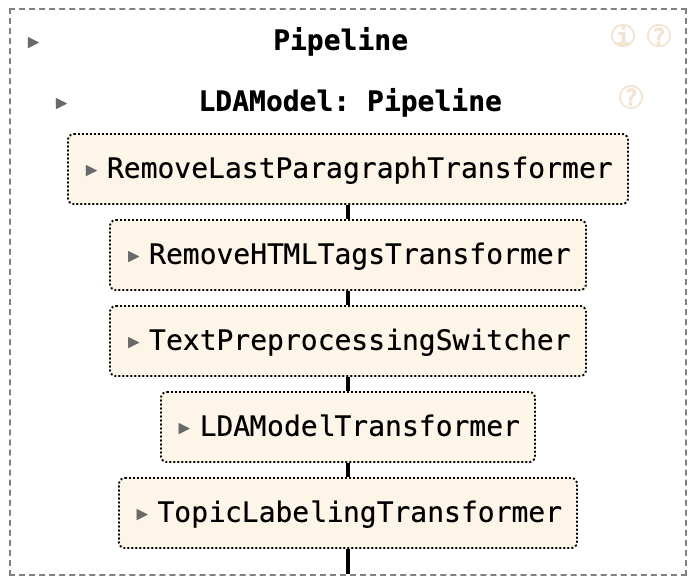

# 📚 NLP Project: Document Classification Using LDA

## 📝 Overview

The current repository is an NLP project that works with **13,301 scientific articles** on different topics in XML format. The objective is the classification of documents into different topics (topic modeling), for which **Latent Dirichlet Allocation (LDA)** is used.

## 🔍 LDA Operation

Latent Dirichlet Allocation (LDA) is a probabilistic model that assumes that documents are composed of a mixture of topics. This document generation process begins with a list of topics, each with an associated probability distribution. Each topic, in turn, has a list of words with a probability distribution.

When a document is generated, k topics are randomly selected from the topic distribution. Words are then selected from the probability distributions corresponding to those topics. This process is repeated to generate each document in the collection.

LDA attempts to backtrack this document generation process to discover what topics might have initially generated the documents. These themes are "latent" because they are hidden and need to be discovered.

To achieve this, LDA factors a document-term matrix (M) containing the word count in all documents. Each row represents a document and each column represents a word in the corpus vocabulary. The entry M[i, j] contains the frequency count of word j in document i.

By factoring this matrix, LDA seeks to identify the latent themes and the word distributions associated with each theme that best explain the distribution of words in the documents.

## 📊 Data Composition

After an exploratory analysis of the data (EDA), we know that we can only work with **13,159 articles**. All of these articles are written in English and exhibit an approximately normal distribution in the number of words.

## 🏗️ Project Composition

To view the Exploratory Data Analysis (EDA), you can find it in `./notebooks/EDA.ipynb` and execute each cell sequentially.

The project in general is located within `/scripts` and is composed of the extraction of the data in the file `../extraction/extract_data.py` where the function `load_xml_files` can be invoked. The output of this function is:
- Summaries stored in a list.
- A list containing the names of each file.
- Two lists containing the separate names of damaged documents and those without a summary.

inside `../trasnformers` is the `pipeline.py` file that contains all the custom transformers that were made to compose the data flow, in particular TextPreprocessingSwitcher was created to give the user the possibility of choosing the traditional tokenization method that nltk offer or do it with bert through BertTokenizer

On the other hand, within the `lda_model.py` file it contains the main function, where when invoking it you can choose whether to use tokenization with bert or not, the number of topics that will be calculated and the number of iterations that the model will do. Inside, it extracts the data, passes it through the pipeline and generates a wordcloud plot as long as wordclouds = True in its constructor. The output of this function is the LDAModelTransformer transformer with its corresponding attributes, the distribution of topics for each document, a list with the name of each file and a list with the labels of each main topic generated from wrod2vec.

results.py calls the previous function and creates a topic distribution graph using tSNE, the same wordcloud plot from main, and a plot counter. Furthermore, its output is a dictionary where each key is the name of the file and the value is a dictionary with keys topic and summary

## 📈 Results

The project offers an interactive way so that, given a file name, the user can see the summary of said file and the topic to which it was assigned. This process is available in `/notebooks/classifier.ipynb`.

---

